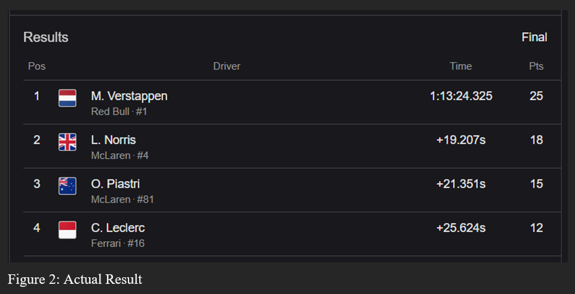

# 🏎️ F1 Top 3 Race Winners Prediction Model

This project is a machine learning–based prediction system that forecasts the **Top 3 finishers of a Formula 1 race** using **qualifying lap times**.  
It was developed as a Mini Project for the Artificial Intelligence course in the Fifth Semester of my B.Tech CSE and demonstrates the practical use of regression models in sports analytics.

The model is trained on historical race data and tested on current-season qualifying performance to predict race outcomes.

---

## 📌 Project Objective

The primary goal of this project is to:
- Predict the **Top 3 drivers** in a Formula 1 race
- Use **qualifying times** as the key predictive feature
- Apply **machine learning regression** to estimate race performance

The project shows how qualifying pace can be translated into race outcome predictions, despite the inherent unpredictability of motorsports.

---

## 📊 Dataset Details

### 1️⃣ Training Data (2024 Season)
- **Source:** `FastF1` Python library  
- **Race Data:** 2024 race lap times for the same Grand Prix round
- **Storage:** Cached locally using `fastf1.Cache.enable_cache("f1_cache")`
- **Features Used:**
  - Driver code (e.g., VER, NOR, LEC)
  - Lap Time (converted to seconds)

Invalid laps such as pit laps or incomplete laps are removed to ensure clean training data.

---

### 2️⃣ Prediction Data (2025 Qualifying)
- **Source:** Manually defined inside the Python script
- **Features Used:**
  - Driver name
  - Qualifying time (seconds)
  - Mapped 3-letter driver code

This dataset represents the current season qualifying performance and is used to predict race results.

---

## ⚙️ Machine Learning Algorithm

### Gradient Boosting Regressor (GBR)

The project uses Gradient Boosting Regression from `scikit-learn`.

**Why Gradient Boosting?**
- Handles non-linear relationships
- Works well with small numerical datasets
- Provides strong performance with limited features

### Evaluation Metric:
- **Mean Absolute Error (MAE)** - Measures the average difference between predicted and actual lap times.
---

### 🧠 Workflow

- Load historical race data using FastF1
- Clean and preprocess lap time data
- Merge qualifying data with historical performance
- Train Gradient Boosting Regression model
- Predict race lap times for current season
- Rank drivers by predicted race time
- Output Top 3 predicted finishers

### 📈 Results

- The model successfully predicted 2 out of the Top 3 finishers correctly

- The remaining predicted driver finished 4th, showing strong near-accuracy

- Mean Absolute Error (MAE): ~1.49 seconds

This indicates that qualifying performance is a strong indicator of race outcome, even with limited data.

---

## 🔮 Future Enhancements

- Include multi-season training data

- Add weather, tyre strategy, and pit stop data

- Experiment with ensemble models or neural networks

- Extend predictions beyond Top 3 (full race classification)

---

## 📌 Disclaimer

This project is intended for educational and analytical purposes only.
Actual Formula 1 race outcomes depend on numerous unpredictable real-world factors.
